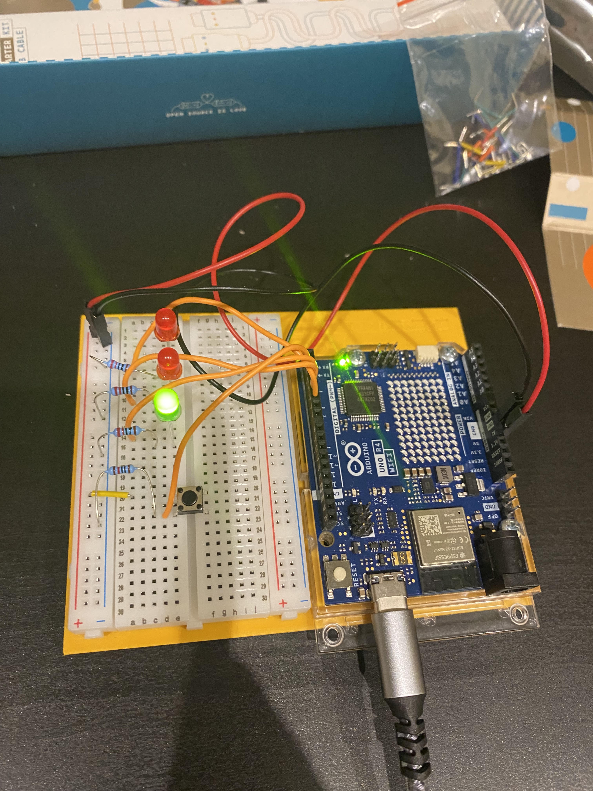

# Project 02 — Button-Controlled LEDs

**Board:** Arduino UNO R4
**Status:** Complete

A pushbutton switches three LEDs (two red, one green) between two states: an
idle pattern where the green LED stays lit and a red LED blinks against it,
and a held pattern where a second red LED stays solidly on.

## Why this project

Project 01 was output only — a fixed pattern with no way for the program to
react to anything. This project adds the other half: reading a digital input
and branching the program's behaviour on it. Three LEDs instead of one also
forces actually tracking multiple output states instead of one.

## Hardware

| Item | Notes |
|---|---|
| Arduino UNO R4 | 5V logic |
| LED (red) | ×2 |
| LED (green) | ×1 |
| Resistor | 220 Ω, one per LED |
| Pushbutton | Tactile switch |
| Breadboard | |
| Jumper wires | |

## Circuit

| Arduino pin | Role |
|---|---|
| D2 | Input — pushbutton |
| D3 | Output — red LED 1 |
| D4 | Output — red LED 2 |
| D5 | Output — green LED |

See [photos/Proyecto2.jpg](photos/Proyecto2.jpg) for the actual wiring.

D2 is configured as plain `INPUT`, not `INPUT_PULLUP` — so whether the pin
reads a clean HIGH or LOW when the button is unpressed depends on an external
pull resistor on the breadboard rather than the Arduino's internal one. Worth
confirming that resistor is actually there; a floating input pin without one
reads noise.

## How it works

`loop()` reads the button once per pass and branches:

- **Button pressed (`LOW`):** after a 1 s delay, red LED 1 turns on and red
  LED 2 / green turn off — a solid red "held" state.
- **Button not pressed (`HIGH`):** green LED turns on and stays on; red LED 2
  toggles every 250 ms, so it blinks while green stays lit. Red LED 1 stays
  off.

Code: [`code/button_led/button_led.ino`](code/button_led/button_led.ino)

## Concepts learned

- `digitalRead()` for a pushbutton, alongside multiple `digitalWrite()` outputs
- Branching `loop()` behaviour on an input's state
- Why a plain `INPUT` pin needs a defined pull resistor (up or down) — left
  floating, its logic level is undefined
- `delay()`-based blink patterns that depend on which branch is active

## Connection to robotics theory

Reading a discrete input and mapping it to a change in actuator state is the
same primitive used later for limit switches, encoders index pulses, and
safety interlocks. This is a first, rough two-state controller — the simplest
possible ancestor of the finite-state machines that later projects (and real
robot behaviour) get built from.

## Possible improvements

- Switch to `INPUT_PULLUP` to remove the dependency on an external pull
  resistor
- Debounce the button read — a raw `digitalRead()` can register spurious
  transitions on press/release
- Replace `delay()` with `millis()`-based timing so the button is polled
  continuously instead of only once per 250 ms/1 s block
- Refactor into an explicit state machine as more states get added

## Photos

