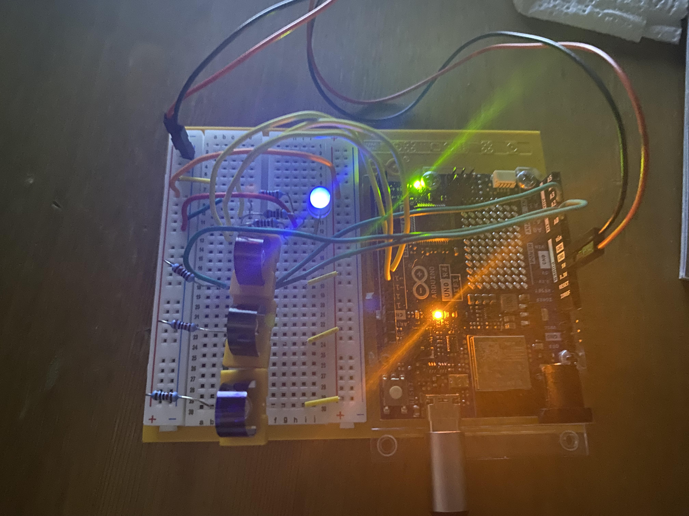

# Project 04 — Color-Mixing Lamp

**Board:** Arduino UNO R4 WiFi
**Status:** Complete

Three phototransistors — one per color channel — each drive the matching
channel of an RGB LED, so the lamp mirrors back the color of light falling
on the sensors.

## Why this project

Project 03 read one analog sensor and mapped it to discrete on/off stages.
This project reads three analog sensors in parallel and drives three PWM
outputs continuously, so the mapping is sensor value → proportional
brightness rather than sensor value → threshold band. It's the first project
combining multiple channels of sensing and actuation at once.

## Hardware

| Item | Notes |
|---|---|
| Arduino UNO R4 WiFi | 5V logic |
| Phototransistor | ×3, one per color channel |
| RGB LED | Common-cathode, PWM-driven per channel |
| Resistor | One per phototransistor (pull-down) |
| Breadboard | |
| Jumper wires | |

## Circuit

| Arduino pin | Role |
|---|---|
| A0 | Input — red-channel phototransistor |
| A1 | Input — green-channel phototransistor |
| A2 | Input — blue-channel phototransistor |
| D9 (PWM) | Output — RGB LED, green |
| D10 (PWM) | Output — RGB LED, red |
| D11 (PWM) | Output — RGB LED, blue |

See [photos/Project4.jpg](photos/Project4.jpg) for the actual wiring. Note
the LED pin assignment doesn't follow R-G-B order (green is D9, red is D10,
blue is D11) — worth double-checking against the code rather than assuming
from pin order on the breadboard.

## How it works

`loop()` reads all three phototransistors with `analogRead()` (each 0–1023),
then scales each down to the 0–255 range `analogWrite()` expects by dividing
by 4, and writes each value straight to its corresponding LED pin:

```
redValue   = redSensorValue   / 4;
greenValue = greenSensorValue / 4;
blueValue  = blueSensorValue  / 4;
```

Raw and scaled values for all three channels are printed over serial every
loop for observation. There's no smoothing or calibration — the LED tracks
the raw sensor reading directly, so ambient light and each phototransistor's
individual sensitivity both show up directly in the output color.

Code: [`code/color_mixing_lamp/color_mixing_lamp.ino`](code/color_mixing_lamp/color_mixing_lamp.ino)

## Concepts learned

- Reading multiple analog inputs in one loop pass
- `analogWrite()` / PWM as a way to output a continuous range, not just on/off
- Scaling a 10-bit ADC range (0–1023) down to an 8-bit PWM range (0–255)
- Treating a phototransistor as a light-intensity-to-voltage sensor, same
  general pattern as the TMP36 in project 03 but optical instead of thermal

## Connection to robotics theory

This is proportional (analog) sensing feeding proportional (analog) actuation,
without any thresholding or control logic in between — the simplest possible
sensor-to-actuator mapping. It's a direct precursor to closed-loop control:
later projects will take a continuous sensor signal like this and feed it
into a controller (e.g. PID) rather than writing it straight to an output.

## Possible improvements

- Use `map()` and `constrain()` instead of a raw division, so out-of-range
  values can't produce unexpected `analogWrite()` behaviour
- Calibrate each phototransistor's min/max under known lighting instead of
  assuming all three behave identically
- Smooth readings (moving average) to reduce flicker from ambient light noise
- Add a diffuser over the RGB LED so the mixed color is visible as a single
  blended hue rather than three separate points of light

## Photos


