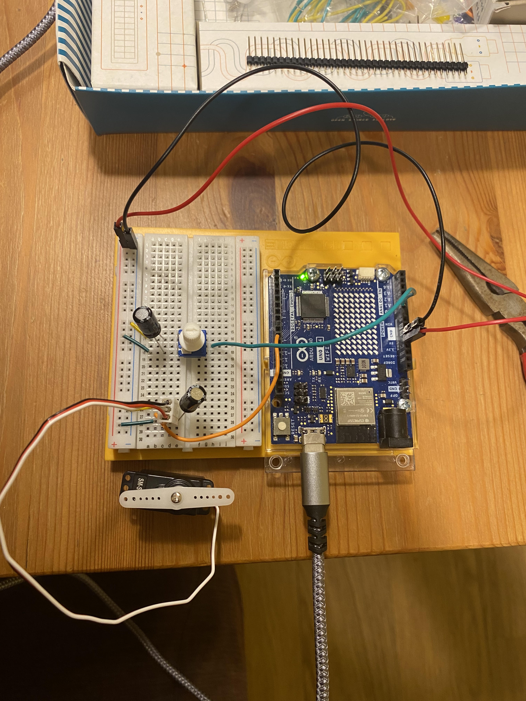

# Project 05 — Potentiometer-Controlled Servo

**Board:** Arduino UNO R4 WiFi
**Status:** Complete

A potentiometer's position directly sets a servo's angle — turning the knob
turns the servo arm to match.

## Why this project

Project 04 mapped a continuous sensor reading to a continuous *brightness*.
This project maps a continuous sensor reading to a continuous *angular
position* instead, using the `Servo` library rather than raw PWM. It's the
first project with a mechanical output — the arm actually moves and holds a
position — rather than an electrical one.

## Hardware

| Item | Notes |
|---|---|
| Arduino UNO R4 WiFi | 5V logic |
| Potentiometer | Analog output |
| Micro servo | Signal wire on D9, powered separately from V+/GND |
| Breadboard | |
| Jumper wires | |

## Circuit

| Arduino pin | Role |
|---|---|
| A0 | Input — potentiometer wiper |
| D9 | Output — servo signal (PWM) |

See [photos/project5.jpg](photos/project5.jpg) for the actual wiring. The
servo runs on its own three-wire lead (power, ground, signal) straight to the
Arduino rather than through the breadboard.

## How it works

`setup()` calls `analogReadResolution(12)`, switching the ADC from its
default 10-bit range (0–1023) to 12-bit (0–4095) — the UNO R4's ADC supports
the higher resolution, unlike the older UNO's fixed 10-bit ADC. `myServo.attach(9)`
binds the `Servo` object to D9.

`loop()` reads the potentiometer, then uses `map()` to convert the 12-bit
reading directly to a servo angle:

```
angle = map(potVal, 0, 4095, 0, 179);
myServo.write(angle);
```

`Servo::write()` takes care of generating the actual PWM pulse train the
servo expects — the sketch just supplies a target angle, not a raw duty
cycle. A 15 ms delay paces the loop.

Code: [`code/servo_potentiometer/servo_potentiometer.ino`](code/servo_potentiometer/servo_potentiometer.ino)

## Concepts learned

- `analogReadResolution()` and using the UNO R4's full 12-bit ADC range
- `map()` to rescale one numeric range onto another (ADC counts → degrees)
- The `Servo` library as an abstraction over PWM — angle in, pulse train out
- Driving a servo from a separate power lead rather than through the
  breadboard rails

## Connection to robotics theory

This is the first project that outputs an angular *position* rather than a
voltage or a light level — the same primitive that drives every joint on an
articulated robot. A potentiometer-driven servo is manual teleoperation of
a single joint: a human sets the position directly, with no feedback or
control loop involved yet. Later projects (encoders, PID) replace the human
with a controller doing the same job automatically.

## Possible improvements

- Add `constrain()` around the mapped angle so ADC noise near the ends of
  the range can't send an out-of-range value to `write()`
- Smooth the potentiometer reading to remove servo jitter from ADC noise
- Replace the fixed 15 ms delay with `millis()`-based timing
- Drive multiple servos from one potentiometer set, laying groundwork for
  coordinated multi-joint motion

## Photos


