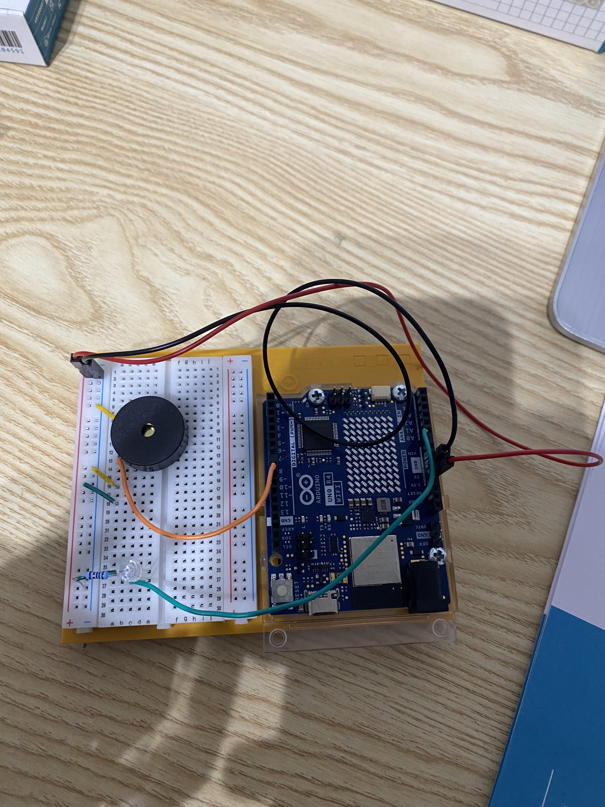

# Project 06 — Light Theremin

**Board:** Arduino UNO R4 WiFi
**Status:** Complete

A photoresistor's light level is mapped to a pitch played on a piezo buzzer
— moving a hand over the sensor changes the note, like a theremin played
with light instead of hand distance from an antenna.

## Why this project

Every prior project mapped a sensor straight to a fixed, known output range.
This one calibrates first: it samples the sensor for 5 seconds at startup to
learn *this specific room's* light range, then maps against that instead of
a hardcoded min/max. It's also the first project producing sound rather than
light or motion, using `tone()` instead of `analogWrite()` or `Servo`.

## Hardware

| Item | Notes |
|---|---|
| Arduino UNO R4 WiFi | 5V logic |
| Photoresistor (LDR) | Voltage divider with a fixed resistor |
| Piezo buzzer | |
| Built-in LED (pin 13) | Used as a calibration-in-progress indicator |
| Breadboard | |
| Jumper wires | |

## Circuit

| Arduino pin | Role |
|---|---|
| A0 | Input — photoresistor voltage divider |
| D8 | Output — piezo buzzer (`tone()`) |
| D13 | Output — built-in LED, lit during calibration |

See [photos/light_theremin.jpg](photos/light_theremin.jpg) for the actual
wiring.

## How it works

`setup()` switches the ADC to 12-bit resolution, then turns on the built-in
LED and spends the first 5 seconds of runtime (`while(millis() < 5000)`)
continuously sampling A0 to find the room's actual `sensorLow` and
`sensorHigh` — whatever range of light the photoresistor sees during that
window, initialized from the widest possible starting bounds (`4095` down to
`0`) so the first real readings always win. The LED turns off once
calibration ends.

`loop()` then reads the sensor and maps the live value against that
calibrated range onto a pitch between 50 Hz and 4000 Hz:

```
int pitch = map(sensorValue, sensorLow, sensorHigh, 50, 4000);
tone(8, pitch, 20);
```

Each `tone()` call plays for 20 ms before the next reading, so the pitch
updates roughly every 10–30 ms as light changes.

Code: [`code/light_theremin/light_theremin.ino`](code/light_theremin/light_theremin.ino)

## Concepts learned

- Runtime self-calibration: sampling a sensor's actual range at startup
  instead of hardcoding expected min/max values
- Using a blocking `while` loop with `millis()` for a timed calibration
  window, distinct from `delay()`
- `tone()` for generating audio frequencies on a digital pin
- A photoresistor as a light-to-resistance sensor, read through a voltage
  divider — the same electrical pattern as the TMP36 and phototransistors in
  earlier projects, different sensing element

## Connection to robotics theory

Self-calibration at startup is a small but real instance of a robot adapting
its own operating parameters to its current environment rather than trusting
fixed assumptions — the same reason IMUs are zeroed and camera exposure is
auto-tuned before a robot starts operating. Sampling for a bounded window and
committing to the result is also a simple version of the same tradeoff every
calibration routine faces: more time gets a better range estimate, but the
robot can't act until calibration finishes.

## Possible improvements

- Re-run calibration on demand (e.g. a button press) instead of only once at
  power-on, so the range can adapt if room lighting changes later
- Guard against `sensorHigh == sensorLow` (a perfectly still light source
  during calibration), which would make `map()` divide by zero
- Smooth the sensor reading to reduce pitch jitter from ADC noise
- Replace the fixed `tone()` duration/delay with `millis()`-based timing

## Photos


