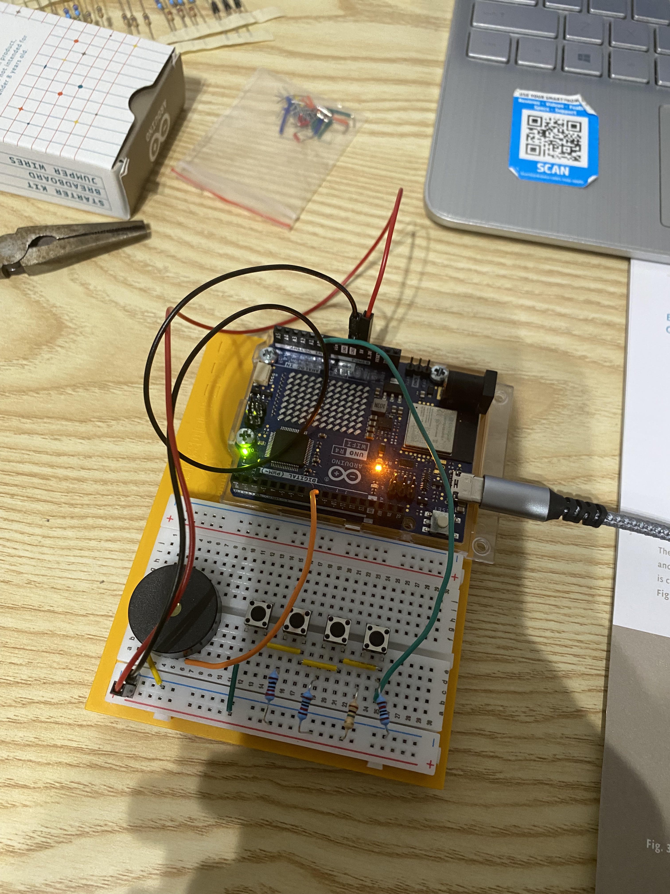

# Project 07 — Resistor-Ladder Keyboard

**Board:** Arduino UNO R4 WiFi
**Status:** Complete

Four pushbuttons, each wired through a different resistor into a single
analog pin, play four distinct notes on a piezo buzzer — a 4-key instrument
read entirely through one analog input.

## Why this project

Project 02 read one button on one digital pin. This project reads four
buttons through a single *analog* pin instead, using a resistor ladder so
each button produces a different voltage rather than needing four separate
digital inputs. It's a different way of solving the same "which button is
pressed" problem, trading digital pins for analog thresholds.

## Hardware

| Item | Notes |
|---|---|
| Arduino UNO R4 WiFi | 5V logic |
| Pushbutton | ×4 |
| Resistor | ×4, one per button, forming a resistor ladder |
| Piezo buzzer | |
| Breadboard | |
| Jumper wires | |

## Circuit

| Arduino pin | Role |
|---|---|
| A0 | Input — resistor-ladder keypad (all 4 buttons) |
| D8 | Output — piezo buzzer (`tone()`) |

See [photos/keyboard_instrument.jpg](photos/keyboard_instrument.jpg) for the
actual wiring. Each button sits behind its own resistor, and each button/
resistor pair taps a different point in the divider — so pressing a
different key changes the voltage `analogRead(A0)` sees to a different,
roughly known value, instead of just toggling one pin HIGH or LOW.

## How it works

`loop()` reads A0 and checks it against four narrow ranges, each
corresponding to one button/resistor combination, and plays the matching
note from a lookup table:

```
int notes[] = {262, 294, 330, 349};  // C4, D4, E4, F4
...
if (keyVal >= 1020 && keyVal <= 1024)      tone(8, notes[0]);
else if (keyVal >= 1000 && keyVal <= 1010) tone(8, notes[1]);
else if (keyVal >= 490 && keyVal <= 515)   tone(8, notes[2]);
else if (keyVal >= 15 && keyVal <= 25)     tone(8, notes[3]);
else                                        noTone(8);
```

The ranges were found by reading the raw `Serial.println(keyVal)` output
for each button and narrowing in on its actual value — not calculated from
the resistor values up front. No button pressed (or two pressed at once)
falls outside all four ranges and silences the buzzer.

Code: [`code/keyboard_instrument/keyboard_instrument.ino`](code/keyboard_instrument/keyboard_instrument.ino)

## Concepts learned

- Resistor ladders: reading several discrete inputs through one analog pin
  by giving each one a different divider value
- Empirically determining threshold ranges from real sensor output rather
  than assuming exact theoretical values
- `tone()` driven by a lookup table of musical note frequencies

## Connection to robotics theory

This is the same "physical state → discrete decision" problem as project 02,
solved with fewer pins by trading digital simplicity for analog precision.
That tradeoff — pin count vs. read complexity and noise sensitivity — comes
up constantly in real hardware design, especially once a robot has more
inputs (buttons, limit switches, mode selectors) than it has spare digital
pins.

## Possible improvements

- Compute the expected ADC value for each button from the actual resistor
  values instead of hardcoding ranges found by trial and error
- Widen or auto-calibrate the bands so small resistor tolerances or ADC
  noise near a boundary don't cause missed or wrong notes
- Handle simultaneous button presses instead of treating them as "no key"
- Remove the unused `buttons[6]` array — a leftover from an earlier version
  of the sketch that no longer does anything

## Photos


