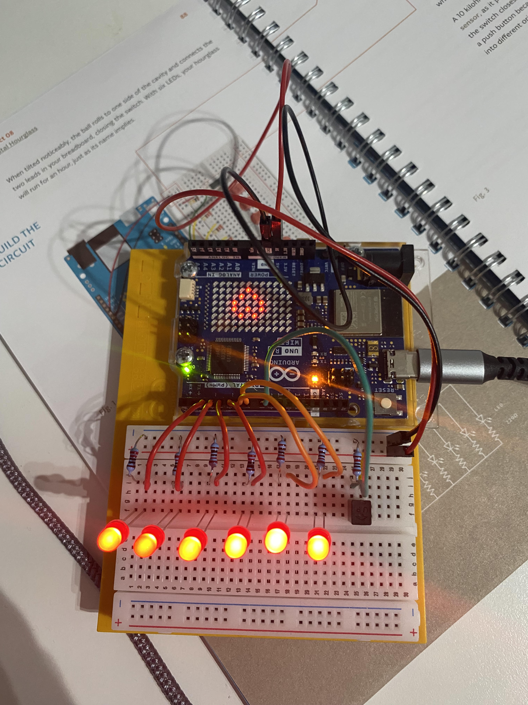

# Project 08 — Digital Hourglass

**Board:** Arduino UNO R4 WiFi
**Status:** Complete

Six LEDs light up one at a time, roughly once a second, like falling grains
of sand. When all six are lit, the built-in LED matrix plays an animation.
A tilt switch — a ball that rolls to one side of a cavity and closes a
circuit — resets the whole thing, standing in for flipping the hourglass
over.

## Why this project

This combines several things from earlier projects into one build: timed,
non-blocking sequencing (`millis()` instead of `delay()`), a digital input
used as an event trigger rather than a held state, and — new here — the UNO
R4's onboard LED matrix, driven through its own library rather than manual
pin control.

## Hardware

| Item | Notes |
|---|---|
| Arduino UNO R4 WiFi | 5V logic, has an onboard 12×8 LED matrix |
| LED (red) | ×6 |
| Resistor | 220 Ω, one per LED |
| Tilt switch | Ball-and-cavity switch; closes when tilted |
| Breadboard | |
| Jumper wires | |

## Circuit

| Arduino pin | Role |
|---|---|
| D2–D7 | Output — six LEDs, lit in sequence |
| D8 | Input — tilt switch |

See [photos/project8.jpg](photos/project8.jpg) for the actual wiring. The
onboard LED matrix needs no external wiring — it's built into the board and
driven entirely through `Arduino_LED_Matrix.h`.

## How it works

`loop()` uses a `millis()`-based interval (1000 ms) to light one more LED
each time it fires, walking `led` from `2` up to `7`. When `led` reaches `8`
— all six LEDs lit — it loads and plays a built-in animation
(`LEDMATRIX_ANIMATION_TETRIS_INTRO`) on the matrix.

Separately, `loop()` reads the tilt switch every pass and compares it
against its previous reading. Any change in state — the ball rolling and
breaking or making contact — resets everything: all six LEDs go dark, `led`
resets to `2`, the timer restarts, and the matrix animation stops and
clears. This means either tilting the board or tilting it back both reset
the sequence, which mirrors turning a real hourglass over.

Code: [`code/hourglass/hourglass.ino`](code/hourglass/hourglass.ino)

## Concepts learned

- Non-blocking timing with `millis()` to run a sequence over time without
  freezing input reads
- Driving the UNO R4's onboard LED matrix via `Arduino_LED_Matrix.h`
- Using a digital input as a change-triggered reset rather than a
  held on/off state
- A tilt switch as a simple mechanical sensor — physically similar to a
  pushbutton, but triggered by orientation instead of a press

## Connection to robotics theory

The `millis()`-based interval loop here is the same non-blocking pattern
every real control loop depends on — sampling and updating on a schedule
without ever blocking on a single output. The tilt switch is also a first
example of a sensor whose *meaning* is decided by the code, not just its
raw signal: the sketch doesn't care whether the switch is opening or
closing, only that its state changed — a decision that has to be deliberate
once inputs get more complex than a single pushbutton.

## Possible improvements

- Scale the six-LED count and 1-second interval so the whole sequence
  actually takes about an hour, matching the name
- Debounce the tilt switch — a rolling ball can bounce and register
  spurious state changes
- Use `analogWrite()` to fade each LED in gradually instead of switching on
  abruptly, for a smoother "sand filling" look
- Replace the hardcoded `LEDMATRIX_ANIMATION_TETRIS_INTRO` with a custom
  frame sequence that actually represents an hourglass emptying

## Photos

