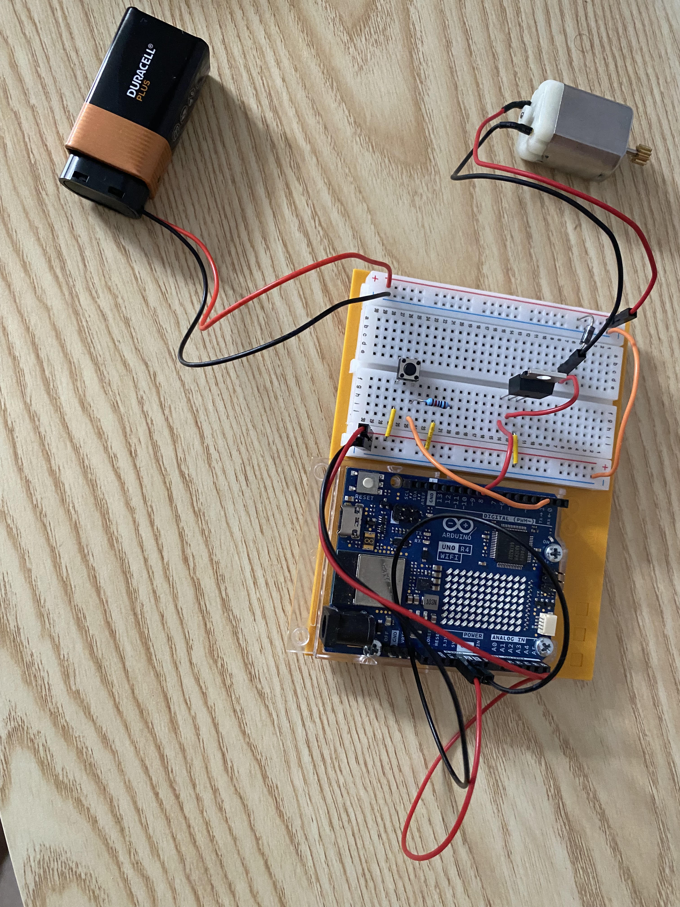

# Project 09 — Motorized Pinwheel

**Board:** Arduino UNO R4 WiFi
**Status:** Complete

A pushbutton switches a DC motor (with a pinwheel on the shaft) on and off.
The motor runs from its own 9V battery, switched by a transistor that the
Arduino's D9 pin controls — the first project where the Arduino drives a
load too large for its own pins to power directly.

## Why this project

Every earlier output (LEDs, a servo, a buzzer) drew little enough current to
run straight off an Arduino pin. A DC motor typically can't — it draws more
current than a pin can safely source, especially under load. This project
introduces the standard fix: use a small signal from the Arduino to switch
a transistor, and let the transistor pass current from a separate, larger
power source to the motor.

## Hardware

| Item | Notes |
|---|---|
| Arduino UNO R4 WiFi | 5V logic |
| DC motor + pinwheel | Powered externally, not from the Arduino |
| Transistor | Switches motor current, driven from D9 |
| Resistor | Current-limiting resistor on the transistor's base |
| Pushbutton | |
| 9V battery + clip | Motor's own power supply |
| Breadboard | |
| Jumper wires | |

## Circuit

| Arduino pin | Role |
|---|---|
| D2 | Input — pushbutton |
| D9 | Output — transistor base (switches motor on/off) |

See [photos/motor.jpg](photos/motor.jpg) for the actual wiring. The 9V
battery's positive lead feeds the motor circuit through the transistor
rather than through the Arduino; only the transistor's base is driven by
D9, and the Arduino and motor circuits share a common ground.

## How it works

`loop()` reads the pushbutton on D2 and mirrors its state directly onto D9:

```
switchState = digitalRead(switchPin);
digitalWrite(motorPin, switchState == HIGH ? HIGH : LOW);
```

D9 drives the transistor's base. When D9 is HIGH, the transistor switches
on and connects the motor to the 9V battery, spinning the pinwheel; when
D9 is LOW, the transistor cuts off and the motor stops. The Arduino itself
never carries the motor's current — it only supplies the small base current
that tells the transistor to switch.

Note D9 is a PWM-capable pin, but this sketch only ever writes it HIGH or
LOW — full on/off, no speed control.

Code: [`code/motorized_pinwheel/motorized_pinwheel.ino`](code/motorized_pinwheel/motorized_pinwheel.ino)

## Concepts learned

- Why a motor generally needs a transistor (or driver IC) instead of
  running straight off a digital pin
- Separating a low-current control circuit (Arduino, button, transistor
  base) from a higher-current load circuit (battery, motor), joined only
  through a shared ground
- Using digitalRead to switch a transistor, functionally the same as
  switching an LED but with a much larger load on the far side

## Connection to robotics theory

This is the actuation pattern nearly every robot motor uses: software
controls a small switching signal, and a separate driver stage handles the
real current and voltage the motor needs. A single transistor like this one
switches a motor on and off in one direction only; an H-bridge driver is
the natural next step, adding reverse direction and, with PWM instead of
`digitalWrite()`, continuous speed control.

## Possible improvements

- Swap `digitalWrite()` for `analogWrite()` on D9 to control motor speed
  via PWM instead of just on/off
- Add a flyback diode across the motor if one isn't already present, to
  protect the transistor from the voltage spike when the motor switches off
- Move to an H-bridge driver to add reverse direction, not just on/off
- Debounce the pushbutton read

## Photos


