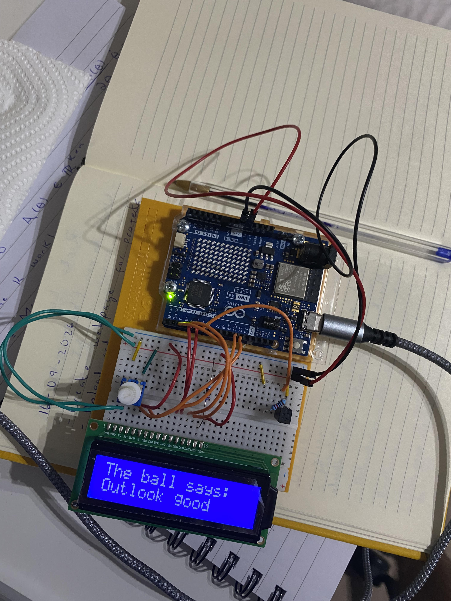

# Project 10 — Crystal Ball

**Board:** Arduino UNO R4 WiFi
**Status:** Complete

A Magic 8-Ball on a 16×2 character LCD. Tilt the switch to "ask", and the
board picks one of eight fortunes at random and prints it to the screen.

## Why this project

This is the first project with a real display. Every earlier output was a
single physical quantity — a light, a tone, an angle, a spinning motor.
Here the output is *text*, driven through the `LiquidCrystal` library over a
parallel interface. It also combines the tilt-switch edge detection from the
digital hourglass with a random choice, so the same physical gesture gives a
different result each time.

## Hardware

| Item | Notes |
|---|---|
| Arduino UNO R4 WiFi | 5V logic |
| 16×2 character LCD | Hitachi HD44780-compatible, 4-bit parallel mode |
| Potentiometer | Sets LCD contrast on the V0 pin |
| Tilt switch | Ball-and-cavity switch used as the "ask" trigger |
| Resistor | For the tilt switch |
| Breadboard | |
| Jumper wires | |

## Circuit

| Arduino pin | Role |
|---|---|
| D12 | LCD RS (register select) |
| D11 | LCD E (enable) |
| D5 | LCD D4 |
| D4 | LCD D5 |
| D3 | LCD D6 |
| D2 | LCD D7 |
| D6 | Input — tilt switch |

See [photos/crystalball.jpg](photos/crystalball.jpg) for the actual wiring.
The LCD runs in 4-bit mode — only four data lines (D4–D7) instead of eight —
which is why `LiquidCrystal` is initialised with six pins total. A
potentiometer feeds the LCD's V0 contrast pin; without it the characters are
either invisible or fully blocked out.

## How it works

`setup()` starts the LCD with `lcd.begin(16, 2)` (16 columns, 2 rows) and
prints a two-line "Ask the Crystal Ball!" prompt.

`loop()` reads the tilt switch every pass and, like the digital hourglass,
acts only on a *change* of state — comparing `switchState` to
`prevSwitchState`. When the switch newly reads `LOW`, it:

1. picks a fortune with `random(8)` (0–7),
2. clears the screen and prints "The ball says:",
3. uses a `switch` statement to print one of eight replies — from "Yes" and
   "Certainly" through "Unsure" to "Doubtful" and "No".

Because it triggers on a state change rather than a level, one tilt produces
exactly one new fortune instead of re-rolling every loop pass.

Code: [`code/crystalball/crystalball.ino`](code/crystalball/crystalball.ino)

## Concepts learned

- Driving an HD44780 character LCD with the `LiquidCrystal` library in 4-bit
  mode: `begin()`, `print()`, `setCursor()`, `clear()`
- Why the LCD needs a contrast potentiometer on V0
- `random()` for selecting between discrete outcomes
- Edge detection (state-change, not level) reused from project 08 to turn one
  physical action into one event
- Mapping an integer to an action with a `switch` statement

## Connection to robotics theory

A character display is the first *human-readable output* in this repo — the
start of a user interface. Robots need a way to report internal state back to
a person (status, sensor readings, error codes), and a small parallel LCD is
the simplest version of that channel. The edge-detection pattern is also
exactly what debouncing and event handling build on: deciding that something
happened *once*, on a transition, rather than continuously while a condition
holds.

## Possible improvements

- Seed the RNG (`randomSeed()`) from a floating analog pin so the sequence of
  fortunes isn't identical after every reset
- Debounce the tilt switch — a rolling ball can bounce and fire more than once
- Store the reply strings in an array (or `PROGMEM`) and index into it instead
  of a long `switch`
- Add a short "shaking…" animation on the LCD before revealing the answer

## Photos

